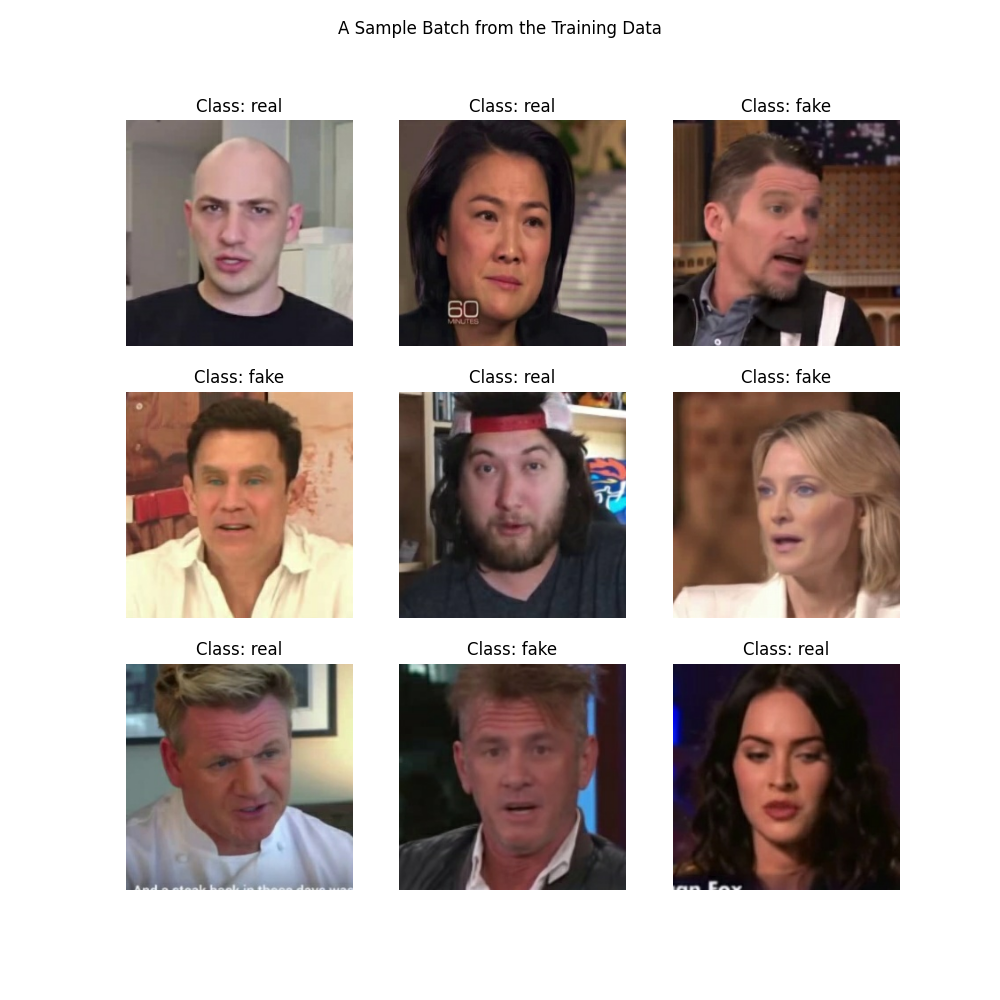

# 🛡️ Deepfake Detector Pro

> **Advanced Forensic Analysis for Digital Media Integrity**  
> *(Basic Image Recognition Project)*



## 📌 Overview

This project is a Deep Learning-based application designed to detect AI-generated "Deepfake" faces. It utilizes **EfficientNetB2** and **Convolutional Neural Networks (CNNs)** to analyze facial artifacts and classify images as **Real** or **Fake**.

The application is deployed using **Streamlit** with a professional, dark-themed UI.

## 🚀 Live Demo

**[Link to your deployed Streamlit App]**  
*(Add your Streamlit Share URL here after deployment)*

## 🛠️ Features

- **Dual AI Engines**:
  - **EfficientNetB2 Pro**: High robustness against texture anomalies.
  - **V1 Basic Model**: Lightweight CNN for fast inference.
- **Live Forensic Analysis**:
  - Real-time Face Detection (MTCNN).
  - Confidence Score Visualization.
  - Heatmap-style bounding boxes (Green=Real, Red=Fake).
- **User Control Panel**:
  - Adjustable Sensitivity Threshold.
  - Detailed Technical Specifications view.

## 💻 Tech Stack

- **Frontend**: Streamlit, Custom CSS
- **Core AI**: TensorFlow, Keras, OpenCV
- **Face Detection**: MTCNN
- **Image Processing**: NumPy, Pillow

## 📂 Project Structure

```
├── app.py                 # Main Application Source
├── requirements.txt       # Dependencies
├── style.css              # Custom UI Styling
├── models/                # Pre-trained Weights
│   ├── deepfake_detector_FINAL.weights.h5
│   └── deepfake_detector_v1.h5
└── training_assets/       # (Archived) Training scripts & history
```

## 🔧 Installation & Usage

1. **Clone the Repository**

    ```bash
    git clone https://github.com/sagar-grv/Deepfake-Detector.git
    cd Deepfake-Detector
    ```

2. **Install Dependencies**

    ```bash
    pip install -r requirements.txt
    ```

3. **Run the App**

    ```bash
    streamlit run app.py
    ```

## 👨‍💻 Developer

**Sagar**  
[](https://github.com/sagar-grv)
[](https://www.linkedin.com/in/sagargrv/)

---
*Disclaimer: This tool is intended for educational and research purposes.*
